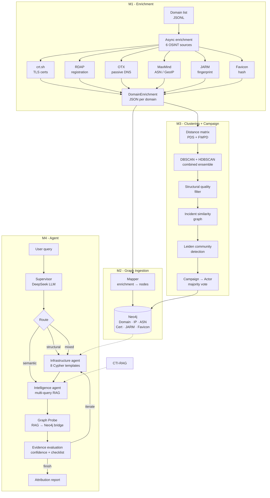

# CTI-Agent

[简体中文 README](README.zh-CN.md)

An agentic Cyber Threat Intelligence attribution system that clusters malicious domains by shared infrastructure patterns and attributes them to threat actors through campaign discovery and multi-agent reasoning.

Given a suspicious domain, the system enriches it from 6 OSINT sources, computes pairwise distances across 7 DNS features, clusters domains via a DBSCAN/HDBSCAN ensemble, discovers campaigns through Leiden community detection on incident similarity graphs, and produces a structured attribution report with confidence scores and cited evidence — all orchestrated by a LangGraph multi-agent pipeline with a natural language interface.

---

## Architecture




---

## Key Features

**Enrichment pipeline** — Async concurrent enrichment from 6 sources with per-source rate limiting (`aiolimiter`), exponential backoff retry, partial failure tolerance, and selective re-enrichment (re-run only specific sources without re-fetching everything).

**Adaptive distance framework** — PDS (Partial Distance Strategy) computes observed distance only over features where both domains have data. FWPD (Feature Weighted Penalty Dissimilarity) penalizes one-sided missing features proportionally to dataset coverage rate. JARM at 0% coverage is auto-disabled; pDNS at 95.6% coverage gets weight 1.75. All weights configurable via YAML profiles.

**Combined clustering ensemble** — DBSCAN-first for high-density clusters, HDBSCAN fallback to recover noise domains (Leite et al., ARES 2024). Post-hoc structural quality scoring per Dupont et al. (2021) filters low-quality clusters by per-feature average dissimilarity. Full parameter sweep with ARI, Silhouette, and cluster purity evaluation against ground truth.

**Campaign discovery** — Incident similarity graph (Jaccard on cluster tag sets + time window filtering) → Leiden community detection with 10-run stability protocol → campaign attribute computation → threat actor attribution via majority vote with shared infrastructure detection.

**Multi-agent attribution** — LangGraph StateGraph with conditional iteration: Supervisor (query analysis via structured LLM output) → deterministic 3-way routing → Infrastructure Agent (8 parameterized Cypher templates with fuzzy actor matching) → Intelligence Agent (DMQR-RAG multi-query rewriting + RRF fusion via [CTI-RAG](https://github.com/chocobo9/CTI-RAG)) → Graph Probe (extracts IOCs from RAG chunks and validates them against Neo4j, bridging semantic evidence back to the knowledge graph) → Evidence Evaluation (confidence scoring + checklist-driven iteration) → Report generation.

**Chainlit UI** — Chat interface that forwards raw user input directly to `graph.ainvoke({"query": user_text})` and renders attribution results with metadata.

---

## Tech Stack


| Layer               | Technology                                                                               |
| ------------------- | ---------------------------------------------------------------------------------------- |
| Enrichment          | `httpx` async + `aiolimiter` rate limiting, 6 OSINT APIs                                 |
| Graph database      | Neo4j 5 (Cypher, MERGE-based idempotent writes)                                          |
| Clustering          | scikit-learn DBSCAN/HDBSCAN, `rapidfuzz`, precomputed distance matrices                  |
| Campaign discovery  | `leidenalg` + `igraph` (Leiden community detection)                                      |
| Agent orchestration | LangGraph `StateGraph` with conditional edges                                            |
| LLM                 | DeepSeek (query analysis, evidence evaluation)                                           |
| RAG                 | [CTI-RAG](https://github.com/chocobo9/CTI-RAG) — hybrid dense+sparse retrieval with HyDE |
| Frontend            | Chainlit chat interface                                                                  |
| Dataset             | OTX + ThreatFox, 938 domains (216 actor + 240 family + 100 shared infra)                 |


---

## Project Structure

```
cti-agent/
├── src/cti_agent/
│   ├── enrichment/          # M1: 6-source async OSINT enrichment
│   │   ├── orchestrator.py  #     concurrent gather + partial error handling
│   │   ├── ct_logs.py       #     crt.sh certificate transparency
│   │   ├── passive_dns.py   #     OTX passive DNS + live DNS resolution
│   │   ├── rdap.py          #     RDAP domain registration
│   │   ├── jarm_scanner.py  #     JARM TLS fingerprinting
│   │   ├── favicon.py       #     favicon hash (mmh3)
│   │   ├── geoip.py         #     MaxMind GeoLite2 ASN + city
│   │   └── rate_limit.py    #     per-source rate limiting
│   ├── graph/               # M2: Neo4j schema + repository
│   │   ├── repository.py    #     MERGE-based idempotent graph writes
│   │   ├── schema.py        #     constraints + indexes
│   │   ├── queries.py       #     parameterized read queries
│   │   └── models.py        #     Pydantic node/relationship models
│   ├── ingestion/           # M2: enrichment → graph mapping
│   │   ├── mapper.py        #     DomainEnrichment → graph operations
│   │   └── pipeline.py      #     batch ingestion with reports
│   ├── clustering/          # M3: domain clustering
│   │   ├── distance.py      #     7 pairwise distance functions
│   │   ├── composite.py     #     PDS + FWPD composite distance
│   │   ├── matrix.py        #     NxN distance matrix (parallel)
│   │   ├── clusterer.py     #     DBSCAN/HDBSCAN/combined + sweep
│   │   └── quality.py       #     structural quality scoring
│   ├── campaign/            # M3: campaign discovery
│   │   ├── similarity.py    #     incident similarity graph
│   │   ├── leiden.py         #     Leiden + stability protocol
│   │   ├── grid_search.py   #     θ_min × γ parameter search
│   │   ├── actor_mapping.py #     campaign → actor attribution
│   │   └── writer.py        #     results → Neo4j
│   ├── agent/               # M4: LangGraph multi-agent
│   │   ├── graph.py         #     StateGraph wiring
│   │   ├── supervisor.py    #     query analysis (LLM call #1)
│   │   ├── routing.py       #     deterministic template selection
│   │   ├── nodes/
│   │   │   ├── infrastructure.py  # Cypher template execution
│   │   │   ├── intelligence.py    # multi-query RAG retrieval
│   │   │   ├── graph_probe.py     # RAG→Neo4j entity bridge
│   │   │   ├── evidence_eval.py   # confidence + iteration logic
│   │   │   └── report.py          # attribution report assembly
│   │   └── tools/
│   │       ├── cypher_templates.py  # 8 parameterized queries
│   │       └── rag_retriever.py     # CTI-RAG adapter
│   ├── pipeline.py          # end-to-end batch orchestration
│   └── models.py            # DomainInput JSONL loader
├── config/
│   └── clustering_profiles/ # YAML weight configs (default, coverage_weighted, ...)
├── scripts/                 # CLI tools, dataset builders, eval scripts
│   ├── app_chainlit.py      # Chainlit UI
│   ├── run_clustering.py    # clustering entry point
│   ├── m2_dataset_builder.py
│   ├── m3_campaign_discovery.py
│   ├── eval_attribution.py  # end-to-end eval (precision/recall/F1)
│   └── ...
├── docker-compose.yml       # Neo4j 5 container
└── pyproject.toml
```

---

## Quick Start

### Prerequisites

- Python 3.11+
- Docker (for Neo4j)
- API keys: OTX (required for pDNS), DeepSeek (required for agent LLM)
- [CTI-RAG](https://github.com/chocobo9/CTI-RAG) installed in the same virtualenv (for RAG retrieval)

### Setup

> **Note:** Installing CTI-RAG may pull in PyTorch (~2GB). A future revision may replace this with a service connection between the agent and the RAG backend.

```bash
# 1. Clone and enter the project
git clone https://github.com/chocobo9/cti-agent.git
cd cti-agent
git checkout dev

# 2. Start Neo4j
docker compose up -d

# 3. Create virtualenv and install (extras are defined in pyproject.toml)
python -m venv .venv && source .venv/bin/activate  # Windows: .venv\Scripts\activate
pip install -e ".[all]"           # core + clustering + agent + UI (largest footprint)
# pip install -e "."              # core only: enrichment + ingestion + Neo4j client (~minimal)
# pip install -e ".[clustering]" # core + M3: numpy, sklearn, rapidfuzz, leidenalg, igraph
# pip install -e ".[agent]"       # core + M4: LangGraph stack (no clustering / no Chainlit)
# pip install -e ".[ui]"          # Chainlit only (usually combined with other extras)
# pip install -e ".[dev]"         # [all] + pytest, pytest-asyncio, ruff — use for running tests

# 4. Configure environment
cp .env.example .env
# Edit .env: set OTX_API_KEY, DEEPSEEK_API_KEY, NEO4J_PASSWORD

# 5. Initialize Neo4j schema
python scripts/init_neo4j_schema.py
```

### Usage

**Interactive mode** — chat with the agent through Chainlit:

```bash
chainlit run scripts/app_chainlit.py
```

Ask in natural language: "Who is behind evil.com?", "Analyze hamadryas.online", "What threat actors use CHOOPA hosting?"

**Batch pipeline** — enrich domains from a JSONL file and ingest into Neo4j:

```bash
python scripts/run_batch.py --input data/domains.jsonl --concurrency 10
```

**Clustering + campaign discovery** — run on all enriched domains:

```bash
python scripts/compute_distance_matrix.py --profile-name coverage_weighted
python scripts/m3_write_graph.py
python scripts/m3_campaign_discovery.py
```

**Attribution evaluation** — test against ground truth:

```bash
python scripts/eval_attribution.py --sample 20 --delay 3
```

### Chainlit UI

```bash
chainlit run scripts/app_chainlit.py
```

---

## API Reference

### Enrichment (M1)


| Function                                                      | Description                                            |
| ------------------------------------------------------------- | ------------------------------------------------------ |
| `enrich_domain(domain) → DomainEnrichment`                    | Enrich a single domain from all 6 sources concurrently |
| `enrich_batch(domains, concurrency) → list[DomainEnrichment]` | Batch enrichment with semaphore-controlled concurrency |
| `save_enrichment_json(enrichment, output_dir) → Path`         | Persist enrichment result as JSON                      |


### Graph (M2)


| Function                                         | Description                                               |
| ------------------------------------------------ | --------------------------------------------------------- |
| `GraphRepository(client)`                        | MERGE-based idempotent graph write interface (23 methods) |
| `init_schema(client)`                            | Create uniqueness constraints and indexes                 |
| `ingest_batch(enrichments, repo) → IngestReport` | Batch-ingest enrichments into Neo4j                       |


### Clustering (M3)


| Function                                                                | Description                              |
| ----------------------------------------------------------------------- | ---------------------------------------- |
| `build_distance_matrix(enrichments, config) → DistanceMatrixResult`     | Compute NxN PDS+FWPD distance matrix     |
| `run_dbscan(matrix, eps, min_samples) → ClusterResult`                  | DBSCAN on precomputed distances          |
| `run_hdbscan(matrix, min_cluster_size) → ClusterResult`                 | HDBSCAN on precomputed distances         |
| `run_combined(matrix, dbscan_params, hdbscan_params) → ClusterResult`   | DBSCAN-first + HDBSCAN fallback ensemble |
| `evaluate_clustering(result, matrix, ground_truth) → ClusterEvaluation` | Silhouette + ARI + purity evaluation     |
| `WeightConfig.from_yaml(path, profile_name) → WeightConfig`             | Load feature weights from YAML profile   |


### Campaign (M3)


| Function                                                                 | Description                               |
| ------------------------------------------------------------------------ | ----------------------------------------- |
| `build_similarity_graph(incidents, theta_min) → (Graph, eligible)`       | Jaccard similarity graph with time window |
| `run_leiden_stable(graph, resolution, n_runs) → LeidenResult`            | Leiden with 10-run median stability       |
| `compute_campaigns(incidents, membership) → list[CampaignRecord]`        | Campaign attribute computation            |
| `map_campaigns_to_actors(campaigns, ...) → list[ActorAttribution]`       | Majority vote actor attribution           |
| `write_campaigns_to_neo4j(repo, campaigns, attributions) → WriteSummary` | Persist to Neo4j                          |


### Agent (M4)


| Function                                      | Description                           |
| --------------------------------------------- | ------------------------------------- |
| `create_orchestrator_agent() → CompiledGraph` | Create ReAct agent with tool bindings |
| `compile_attribution_graph() → CompiledGraph` | Build the multi-agent StateGraph      |
| `attribute_domain(domain) → str`              | Tool: full attribution pipeline       |
| `process_domains(domains) → str`              | Tool: enrichment + ingestion          |
| `search_cti(query) → str`                     | Tool: hybrid RAG search               |


---

## 7 DNS Features


| #   | Feature           | Distance Function                                            | Category      |
| --- | ----------------- | ------------------------------------------------------------ | ------------- |
| 1   | Domain string     | Levenshtein on SLD, normalized                               | Identity      |
| 2   | Registration time | Absolute day difference / 365                                | Identity      |
| 3   | TLS certificate   | Best-match issuer (0.4) + SAN Jaccard (0.6)                  | Identity      |
| 4   | JARM fingerprint  | Hamming on cipher (30 chars) + Levenshtein on ext (32 chars) | Configuration |
| 5   | Favicon hash      | Binary exact match                                           | Configuration |
| 6   | Passive DNS       | IP-set Jaccard (validated, routable IPs only)                | Behavior      |
| 7   | ASN + GeoIP       | ASN-set Jaccard (0.6) + country-set Jaccard (0.4)            | Behavior      |


Missing data is handled via PDS (exclude both-missing) + FWPD (penalize one-sided missing by dataset coverage rate). See `clustering/composite.py` for the full algorithm.

---

## Dataset

The evaluation dataset contains **938 domains** constructed from OTX threat intelligence pulses and ThreatFox IOC feeds:


| Group                 | Count | Description                                                         |
| --------------------- | ----- | ------------------------------------------------------------------- |
| Actor attribution     | 216   | Domains attributed to specific threat actors (APT28, Lazarus, etc.) |
| Family attribution    | 240   | Domains attributed to malware families (ClearFake, AsyncRAT, etc.)  |
| Shared infrastructure | 100   | MaaS/shared hosting domains (Cobalt Strike, Phorpiex)               |
| Negative controls     | 382   | Domains with no known attribution                                   |


Ground truth labels are persisted as `GROUND_TRUTH_ATTRIBUTION` edges in Neo4j for evaluation. Dataset construction scripts: `scripts/m2_dataset_builder.py`, `scripts/m2_actor_normalization.py`, `scripts/m2_conflict_resolution.py`.

---

## Related Projects

- **[CTI-RAG](https://github.com/chocobo9/CTI-RAG)** — Hybrid RAG system for CTI retrieval (dense + BM25 sparse + HyDE + RRF fusion). Provides the knowledge retrieval layer consumed by this agent's Intelligence module.

---

## References

- Leite, C., den Hartog, J., & dos Santos, D. R. (2024). *Using DNS Patterns for Automated Cyber Threat Attribution*. ARES 2024. DOI: 10.1145/3664476.3670870
- Dupont, G. et al. (2021). *Structural quality scoring for domain clusters*. Applied to post-hoc cluster filtering.
- Gao, L. et al. (2023). *Precise Zero-Shot Dense Retrieval without Relevance Labels* (HyDE). ACL 2023.
- DMQR-RAG (arXiv:2411.13154, 2024). Diverse multi-query rewriting for retrieval.
- Lekssays et al. (2025). *TechniqueRAG*. arXiv:2505.11988.

