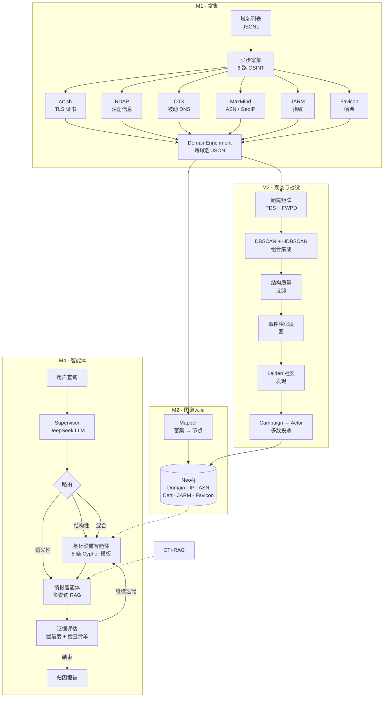

# CTI-Agent

[English README](README.md)

面向网络威胁情报（CTI）的 **智能体化归因系统**：根据恶意域名的共享基础设施模式进行聚类，通过战役（campaign）发现与多智能体推理，将其归因到威胁行为体。

给定一个可疑域名，系统会从 6 个 OSINT 源进行富集，在 7 项 DNS 特征上计算成对距离，使用 DBSCAN/HDBSCAN 组合聚类，在事件相似度图上通过 Leiden 社区发现识别战役，并输出带置信度与引用证据的结构化归因报告；全流程由基于 LangGraph 的多智能体流水线编排，并提供自然语言交互界面。

---

## 架构



---

## 核心能力

**富集流水线** — 6 路数据源异步并发富集，每源速率限制（`aiolimiter`）、指数退避重试、部分失败容错，并支持选择性重跑指定数据源（无需全盘重复抓取）。

**自适应距离框架** — PDS（Partial Distance Strategy）仅在双方都有观测的特征维度上计算距离。FWPD（Feature Weighted Penalty Dissimilarity）按数据集覆盖率对单方缺失特征施加惩罚。JARM 在覆盖率为 0 时自动关闭；pDNS 覆盖率约 95.6% 时权重可设为 1.75。全部权重可通过 YAML 配置文件调节。

**组合聚类集成** — 优先 DBSCAN 捕获高密度簇，HDBSCAN 回收噪声点中的簇结构（Leite et al., ARES 2024）。事后按 Dupont et al. (2021) 做结构质量评分，根据特征维度平均相异性过滤低质量簇。支持网格扫描并结合真实标注评估 ARI、Silhouette 与簇纯度。

**战役发现** — 构建事件相似度图（基于簇标签集合 Jaccard + 时间窗过滤）→ Leiden 社区发现（含 10 次运行的稳定性协议）→ 战役属性计算 → 通过多数投票及共享基础设施检测完成威胁行为体归因。

**多智能体归因** — LangGraph `StateGraph` 与条件迭代：Supervisor（结构化 LLM 输出进行查询分析）→ 确定性三路路由 → 基础设施智能体（8 条参数化 Cypher + 模糊行为体匹配）→ 情报智能体（DMQR-RAG 多查询改写 + 通过 [CTI-RAG](https://github.com/chocobo9/CTI-RAG) 做 RRF 融合）→ 证据评估（置信度与检查清单驱动迭代）→ 报告生成。

**Chainlit 交互 UI** — Chainlit 对话界面将用户原始输入直接传入 `graph.ainvoke({"query": user_text})`，并展示归因结果与相关元数据。

---

## 技术栈

| 层级       | 技术 |
| ---------- | ---- |
| 富集       | `httpx` 异步 + `aiolimiter` 限流，6 路 OSINT API |
| 图数据库   | Neo4j 5（Cypher，基于 MERGE 的幂等写入） |
| 聚类       | scikit-learn DBSCAN/HDBSCAN、`rapidfuzz`、预计算距离矩阵 |
| 战役发现   | `leidenalg` + `igraph`（Leiden 社区发现） |
| 智能体编排 | LangGraph `StateGraph` 与条件边 |
| LLM        | DeepSeek（查询分析、证据评估） |
| RAG        | [CTI-RAG](https://github.com/chocobo9/CTI-RAG) — 稠密 + 稀疏混合检索与 HyDE |
| 前端       | Chainlit 对话界面 |
| 数据集     | OTX + ThreatFox，938 个域名（216 行为体 + 240 家族 + 100 共享基础设施） |

---

## 目录结构

```
cti-agent/
├── src/cti_agent/
│   ├── enrichment/          # M1：6 源异步 OSINT 富集
│   │   ├── orchestrator.py  #     并发 gather + 部分失败处理
│   │   ├── ct_logs.py       #     crt.sh 证书透明度
│   │   ├── passive_dns.py   #     OTX pDNS + 实时 DNS 解析
│   │   ├── rdap.py          #     RDAP 域名注册
│   │   ├── jarm_scanner.py  #     JARM TLS 指纹
│   │   ├── favicon.py       #     favicon 哈希（mmh3）
│   │   ├── geoip.py         #     MaxMind GeoLite2 ASN + 城市
│   │   └── rate_limit.py    #     分源限流
│   ├── graph/               # M2：Neo4j schema + 仓储
│   │   ├── repository.py    #     基于 MERGE 的幂等写入
│   │   ├── schema.py        #     约束与索引
│   │   ├── queries.py       #     参数化读查询
│   │   └── models.py        #     Pydantic 节点/关系模型
│   ├── ingestion/           # M2：富集 → 图谱映射
│   │   ├── mapper.py        #     DomainEnrichment → 图操作
│   │   └── pipeline.py      #     批量入库与报告
│   ├── clustering/          # M3：域名聚类
│   │   ├── distance.py      #     7 种成对距离函数
│   │   ├── composite.py     #     PDS + FWPD 组合距离
│   │   ├── matrix.py        #     N×N 距离矩阵（并行）
│   │   ├── clusterer.py     #     DBSCAN/HDBSCAN/组合 + 扫描
│   │   └── quality.py       #     结构质量评分
│   ├── campaign/            # M3：战役发现
│   │   ├── similarity.py    #     事件相似度图
│   │   ├── leiden.py        #     Leiden + 稳定性协议
│   │   ├── grid_search.py   #     θ_min × γ 参数搜索
│   │   ├── actor_mapping.py #     campaign → 行为体归因
│   │   └── writer.py        #     结果写回 Neo4j
│   ├── agent/               # M4：LangGraph 多智能体
│   │   ├── graph.py         #     StateGraph 接线
│   │   ├── supervisor.py    #     查询分析（LLM 调用 #1）
│   │   ├── routing.py       #     确定性模板选择
│   │   ├── nodes/
│   │   │   ├── infrastructure.py  # Cypher 模板执行
│   │   │   ├── intelligence.py    # 多查询 RAG 检索
│   │   │   ├── evidence_eval.py   # 置信度与迭代逻辑
│   │   │   └── report.py          # 归因报告组装
│   │   └── tools/
│   │       ├── cypher_templates.py  # 8 条参数化查询
│   │       └── rag_retriever.py     # CTI-RAG 适配
│   ├── pipeline.py          # 端到端批量编排
│   └── models.py            # DomainInput JSONL 加载器
├── config/
│   └── clustering_profiles/ # YAML 权重配置（default、coverage_weighted 等）
├── scripts/                 # CLI、数据集构建、评测脚本
│   ├── app_chainlit.py      # Chainlit UI
│   ├── run_clustering.py    # 聚类入口
│   ├── m2_dataset_builder.py
│   ├── m3_campaign_discovery.py
│   ├── eval_attribution.py  # 端到端评测（精确率/召回/F1）
│   └── ...
├── docker-compose.yml       # Neo4j 5 容器
└── pyproject.toml
```

---

## 快速开始

### 前置条件

- Python 3.11+
- Docker（运行 Neo4j）
- API Key：OTX（被动 DNS 必需）、DeepSeek（智能体 LLM 必需）
- 在同一虚拟环境中安装 [CTI-RAG](https://github.com/chocobo9/CTI-RAG)（用于 RAG 检索）

### 环境搭建

> **说明**：当前阶段会完整安装 Torch（约 2GB）；后续计划改为智能体与 RAG 系统之间的服务化连接。

```bash
# 1. 克隆并进入项目
git clone https://github.com/chocobo9/cti-agent.git
cd cti-agent
git checkout dev

# 2. 启动 Neo4j
docker compose up -d

# 3. 创建虚拟环境并安装依赖（分层 extras，见 pyproject.toml）
python -m venv .venv && source .venv/bin/activate   # Windows: .venv\Scripts\activate
pip install -e ".[all]"          # 完整安装：核心 + 聚类 + 智能体 + UI（体量最大，约数 GB 级）
# pip install -e ".[clustering]" # 较轻：核心 + M3 聚类/战役相关依赖（不装 LangGraph/Chainlit）
# pip install -e ".[dev]"        # 开发：等同 [all] + pytest / pytest-asyncio / ruff

# 4. 配置环境变量
cp .env.example .env
# 编辑 .env：设置 OTX_API_KEY、DEEPSEEK_API_KEY、NEO4J_PASSWORD

# 5. 初始化 Neo4j schema
python scripts/init_neo4j_schema.py
```

### 使用方式

**交互模式** — 通过 Chainlit 与智能体对话：

```bash
chainlit run scripts/app_chainlit.py
```

可用自然语言提问，例如：「evil.com 背后是谁？」「分析 hamadryas.online」「哪些威胁行为体使用 CHOOPA 托管？」

**批量流水线** — 从 JSONL 富集域名并写入 Neo4j：

```bash
python scripts/run_batch.py --input data/domains.jsonl --concurrency 10
```

**聚类 + 战役发现** — 基于已富集域名：

```bash
python scripts/compute_distance_matrix.py --profile-name coverage_weighted
python scripts/m3_write_graph.py
python scripts/m3_campaign_discovery.py
```

**归因评测** — 对照 ground truth：

```bash
python scripts/eval_attribution.py --sample 20 --delay 3
```

### Chainlit 界面

```bash
chainlit run scripts/app_chainlit.py
```

---

## API 参考

### 富集（M1）

| 函数 | 说明 |
| ---- | ---- |
| `enrich_domain(domain) → DomainEnrichment` | 单域名并发调用全部 6 源 |
| `enrich_batch(domains, concurrency) → list[DomainEnrichment]` | 批量富集，信号量控制并发 |
| `save_enrichment_json(enrichment, output_dir) → Path` | 将富集结果落盘为 JSON |

### 图谱（M2）

| 函数 | 说明 |
| ---- | ---- |
| `GraphRepository(client)` | 基于 MERGE 的幂等写入接口（23 个方法） |
| `init_schema(client)` | 创建唯一性约束与索引 |
| `ingest_batch(enrichments, repo) → IngestReport` | 批量入库 Neo4j |

### 聚类（M3）

| 函数 | 说明 |
| ---- | ---- |
| `build_distance_matrix(enrichments, config) → DistanceMatrixResult` | 计算 N×N PDS+FWPD 距离矩阵 |
| `run_dbscan(matrix, eps, min_samples) → ClusterResult` | 预计算距离上的 DBSCAN |
| `run_hdbscan(matrix, min_cluster_size) → ClusterResult` | 预计算距离上的 HDBSCAN |
| `run_combined(matrix, dbscan_params, hdbscan_params) → ClusterResult` | DBSCAN 优先 + HDBSCAN 兜底 |
| `evaluate_clustering(result, matrix, ground_truth) → ClusterEvaluation` | Silhouette + ARI + 纯度 |
| `WeightConfig.from_yaml(path, profile_name) → WeightConfig` | 从 YAML 配置加载特征权重 |

### 战役（M3）

| 函数 | 说明 |
| ---- | ---- |
| `build_similarity_graph(incidents, theta_min) → (Graph, eligible)` | 带时间窗的 Jaccard 相似度图 |
| `run_leiden_stable(graph, resolution, n_runs) → LeidenResult` | Leiden + 10 次运行取中位稳定性 |
| `compute_campaigns(incidents, membership) → list[CampaignRecord]` | 战役属性计算 |
| `map_campaigns_to_actors(campaigns, ...) → list[ActorAttribution]` | 多数投票行为体归因 |
| `write_campaigns_to_neo4j(repo, campaigns, attributions) → WriteSummary` | 持久化到 Neo4j |

### 智能体（M4）

| 函数 | 说明 |
| ---- | ---- |
| `create_orchestrator_agent() → CompiledGraph` | 创建带工具绑定的 ReAct 智能体 |
| `compile_attribution_graph() → CompiledGraph` | 构建多智能体 StateGraph |
| `attribute_domain(domain) → str` | 工具：完整归因流水线 |
| `process_domains(domains) → str` | 工具：富集 + 入库 |
| `search_cti(query) → str` | 工具：混合 RAG 检索 |

---

## 七项 DNS 特征

| # | 特征 | 距离函数 | 类别 |
| --- | ----------------- | ------------------------------------------------------------ | ------------- |
| 1 | 域名字符串 | 二级域 Levenshtein，归一化 | 身份 |
| 2 | 注册时间 | 绝对天数差 / 365 | 身份 |
| 3 | TLS 证书 | 最佳匹配issuer（0.4）+ SAN Jaccard（0.6） | 身份 |
| 4 | JARM 指纹 | 加密套件段 Hamming（30）+ 扩展段 Levenshtein（32） | 配置 |
| 5 | Favicon 哈希 | 二进制精确匹配 | 配置 |
| 6 | 被动 DNS | IP 集合 Jaccard（仅校验可达 IP） | 行为 |
| 7 | ASN + GeoIP | ASN 集合 Jaccard（0.6）+ 国家集合 Jaccard（0.4） | 行为 |

缺失数据通过 PDS（双方缺失则剔除维度）+ FWPD（单方缺失按数据集覆盖率惩罚）处理；完整算法见 `clustering/composite.py`。

---

## 数据集

评测数据集含 **938** 个域名，构造自 OTX 威胁情报 pulse 与 ThreatFox IOC：

| 组别 | 数量 | 说明 |
| --------------------- | ----- | ------------------------------------------------------------------- |
| 行为体归因 | 216 | 归因到具体威胁行为体（如 APT28、Lazarus 等） |
| 家族归因 | 240 | 归因到恶意软件家族（如 ClearFake、AsyncRAT 等） |
| 共享基础设施 | 100 | MaaS/共享托管类域名（如 Cobalt Strike、Phorpiex） |
| 负对照 | 382 | 无已知归因的域名 |

Ground truth 以 Neo4j 中 `GROUND_TRUTH_ATTRIBUTION` 关系边的形式持久化以便评测。构建脚本：`scripts/m2_dataset_builder.py`、`scripts/m2_actor_normalization.py`、`scripts/m2_conflict_resolution.py`。

---

## 相关项目

- **[CTI-RAG](https://github.com/chocobo9/CTI-RAG)** — 面向 CTI 检索的混合 RAG（稠密 + BM25 稀疏 + HyDE + RRF）。为本项目情报模块提供知识检索层。

---

## 参考文献

- Leite, C., den Hartog, J., & dos Santos, D. R. (2024). *Using DNS Patterns for Automated Cyber Threat Attribution*. ARES 2024. DOI: 10.1145/3664476.3670870
- Dupont, G. et al. (2021). *Structural quality scoring for domain clusters*. 用于事后簇过滤的结构质量评分。
- Gao, L. et al. (2023). *Precise Zero-Shot Dense Retrieval without Relevance Labels* (HyDE). ACL 2023.
- DMQR-RAG (arXiv:2411.13154, 2024). 多样化多查询改写检索。
- Lekssays et al. (2025). *TechniqueRAG*. arXiv:2505.11988.
